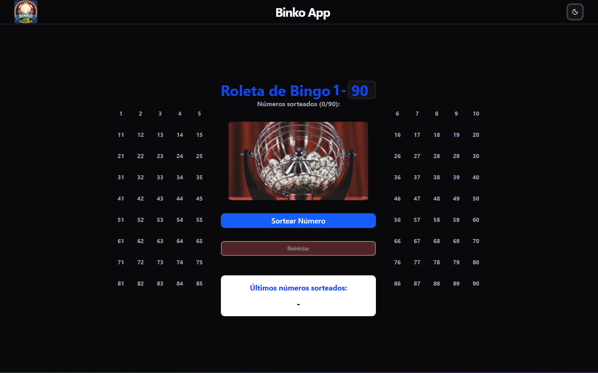
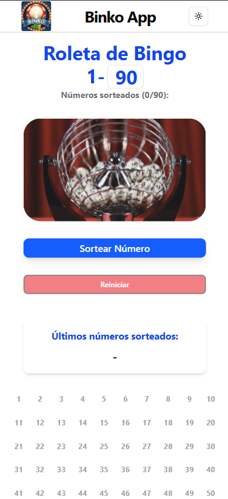

# 🎱 Binko App

A modern and interactive application for drawing bingo numbers, built with React, Tailwind CSS, and shadcn/ui.

## 📋 Features

- **Automatic Draw**: Draws numbers from 1 to 90 without repetition
- **Letter Identification**: Displays the corresponding letter (B-I-N-G-O) for each number
- **Dual Board**: Complete visualization of numbers divided into two columns
- **Highlighted Numbers**: Drawn numbers are visually highlighted in real-time
- **Progress Counter**: Track how many numbers have been drawn (X/90)
- **Reset Button**: Restart the game at any time

## 🎨 Technologies Used

- **React** - JavaScript library for building user interfaces
- **Tailwind CSS** - Utility-first CSS framework for styling
- **shadcn/ui** - Reusable and accessible React components

## 🎯 How It Works

### Letter Correspondence

Traditional bingo divides numbers into 5 groups, each corresponding to a letter in the word "BINGO":

| Letter | Number Range |
|--------|-------------|
| **B** | 1 - 15 |
| **I** | 16 - 30 |
| **N** | 31 - 45 |
| **G** | 46 - 60 |
| **O** | 61 - 90 |

## Layout

### web version



### Mobile version



## 🚀 How to Use

1. **Draw Number**: Click the "Draw Number" button to reveal a new number
2. **Visualize**: The ball will appear with animation showing the letter and number
3. **Track**: See the highlighted numbers on the side boards
4. **Reset**: Use the "Reset" button to start a new game

## Validations

- Does not allow drawing the same number twice
- Alert when all numbers have been drawn
- Disables buttons during animation

## 🛠️ Installation

```bash
# Install dependencies
npm install

# Run the project
npm run dev

# Deploy the project
npm run deploy
```

## 🎨 Customization

### Animation Timing

Adjust the duration in `src/lib/constants.ts`:

```javascript
/* Change these values (in milliseconds) */
export const VIDEO_ANIMATION_DURATION = 2500;
export const BALL_ANIMATION_DURATION = 2500;
```

## 🤝 Contributing

Contributions are welcome! Feel free to:

- Report bugs
- Suggest new features
- Submit pull requests

## 👨‍💻 Author

Developed with ❤️ using React and Tailwind CSS

---

**Have fun playing bingo! 🎉**
